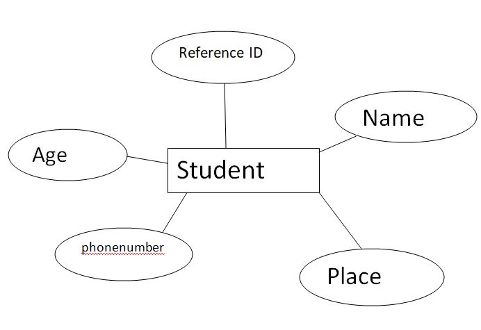
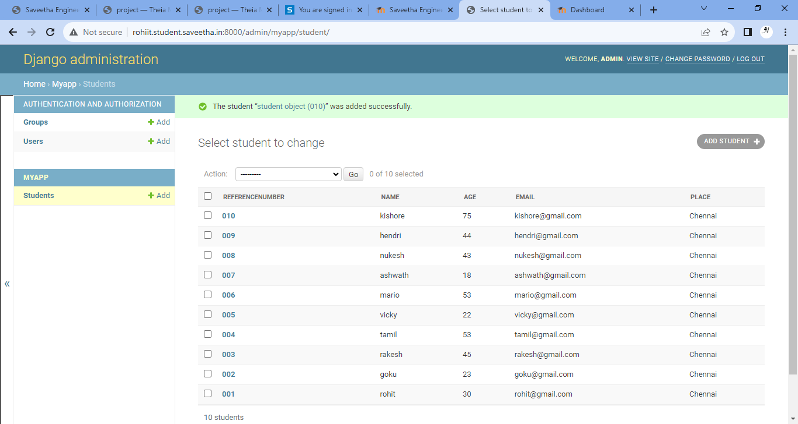
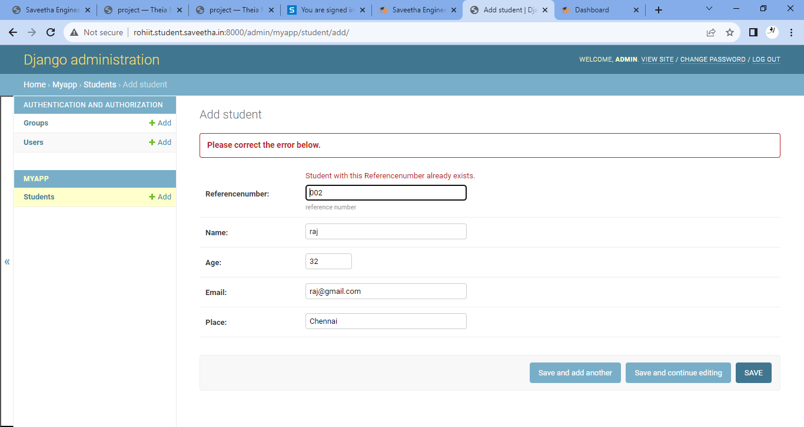

# Django ORM Web Application

## AIM
To develop a Django application to store and retrieve data from a database using Object Relational Mapping(ORM).

## Entity Relationship Diagram

## DESIGN STEPS

### STEP 1:create folder 'exo2' under the directory 'unot2'

### STEP 2:clone the githib repository into the directory 'exo2' using the command "git clone<url>"

### STEP 3:under the folder "django-orm-app", enter the ndirectory titled "dataproject" and enter the folder "dataproject" and go to the file "settings.py" import os in line 14,set ALLOWED_HOSTS=['*'] and 'my app' under the list INSTALLED_ apps

### step 4:return to parent folder "dataproject" and install the application myapp using the command "python3 manage.py startapp myapp

### step 5:under the directory "myapp",open "models.py" and enter the code for the column headings

### step 6:under the directory "myapp",open "admin.py" and code to set up the admin

### step 7:return to parent folder "dataproject", and into the prompt, enter the command "python3 manage,py make migrations

### step 8:into the prompt, enter the command "python3 manage.py migrate"

### step 9:create a superuser by typing the command"python manage.py createsuperuser" into then prompt,enter to create it.

### step 10:into the prompt,type the command "python3 manage.py runserver 0:8000" to run the server at port of new tab

### step 11: open the admin login page and enter the username and password to login

### step 12:under the "MYAPP" section, click on "add" next to "students" to create a record. create 10 records in the same way.

### step 13:once the records are made, take a screenshot and save it.

### step 14:upload the screen shot into the "dataproject" directory by right-clicking on it and selecting "upload files"

### step 15:once excited from the server,type the codes necessary for pushing the files into the github repository.

## PROGRAM

### models.py:
from django.db import models
from django.contrib import admin

class student (models.Model):
    referencenumber=models.CharField(primary_key=True,max_length=20,help_text="reference number")
    name=models.CharField(max_length=100)
    age=models.IntegerField()
    email=models.EmailField()
    place=models.CharField(max_length=80,default='Chennai')

class studentAdmin(admin.ModelAdmin):
    list_display=('referencenumber','name','age','email','place')    

### admin.py:
from django.contrib import admin
from .models import student,studentAdmin

admin.site.register(student,studentAdmin)

## OUTPUT

### student:

### error:

## RESULT
The program is executed successfully.